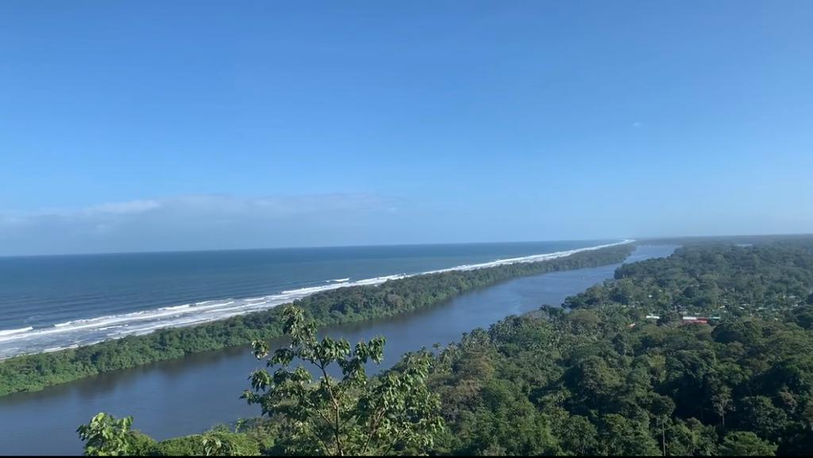

# **Parque Nacional Tortuguero**

   

###### Figura 1. *Mirador Cerro Tortuguero (Foto propia).*   

## **Conociendo el Parque Nacional Tortuguero**

#### El Parque Nacional Tortuguero se encuentra ubicado en la zona Caribe Sur del país, específicamente en Pococí, Limón. Dentro de este parque se encuentran dos comunidades; Tortuguero y San Francisco.

#### Al Parque se puede llegar por medios aéreos o marítimos.   
- Marítimo: Se debe llegar al puerto la pavona  y luego tomar una lancha hacia el parque.   

#### Este parque es una de las áreas de conservacián que está a cargo del [SINAC](https://www.sinac.go.cr/ES/Paginas/default.aspx), donde para ingresar a ciertas áreas se debe pagar un monto de dinero ya que son zonas monitoreadas por ACTo (_Area de Conservación Tortuguero_).   

#### En el parque se pueden realizar distintas actividades como:

1. Tour de senderismo y avistamiento de distintas especies.   
2. Tour del Cerro Tortuguero.   
3. Tour de anidación de tortugas (Temporada de anidación y desove).   
4. Tour por los canales del parque.     

#### Además, se puede recorrer la comunidad que es muy pintoresca y alegre, visitar restaurantes con vista al mar o al lago y recorrer la playa.

###### Figura 2. *Tortuga Verde en temporada de anidación. Tomada de la Galería de la página del Parque Nacional Tortuguero.*

#### Más información sobre este lugar y sus atractivos en [Parque Nacional Tortuguero](https://www.sinac.go.cr/ES/ac/acto/pnt/Paginas/default.aspx). 

